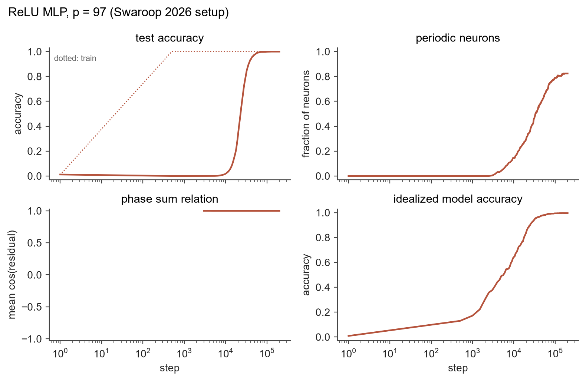
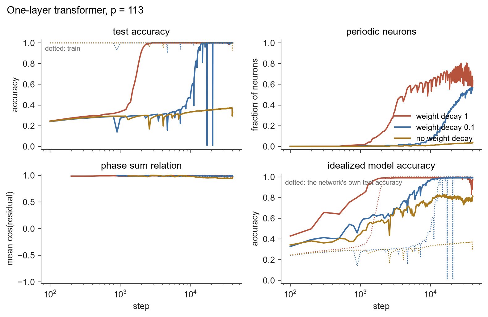
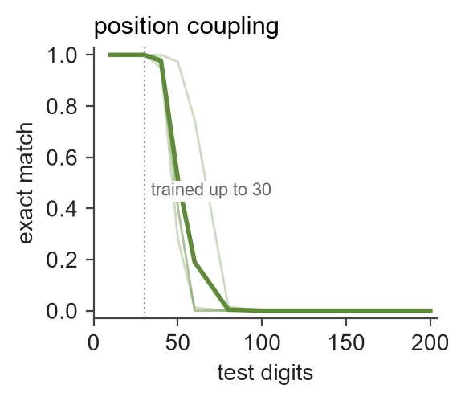
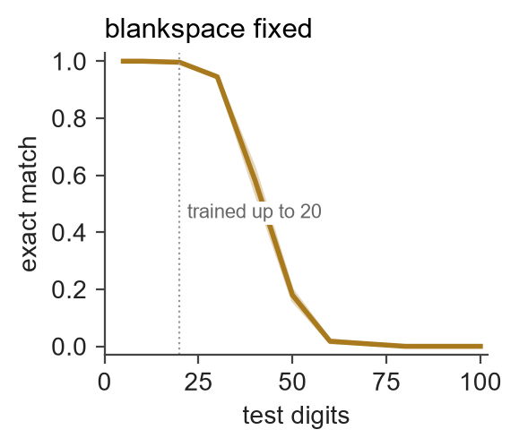
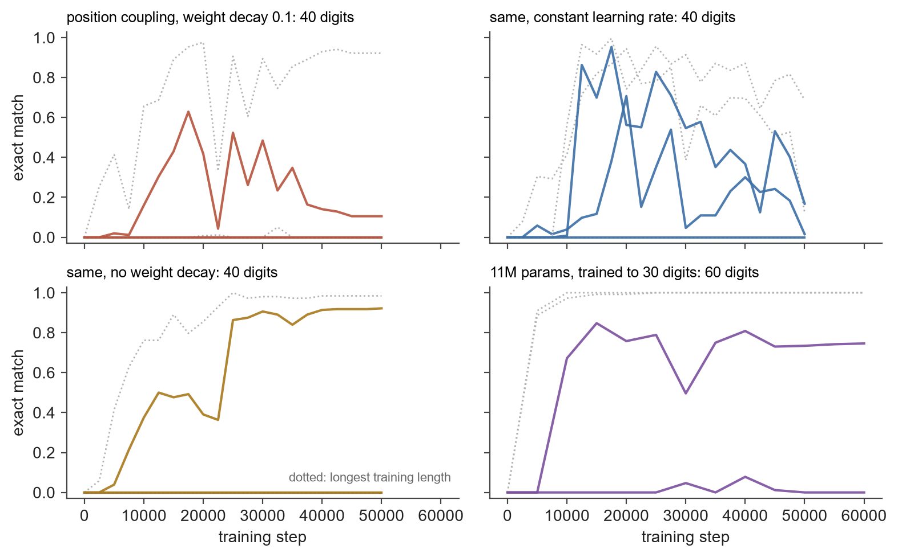
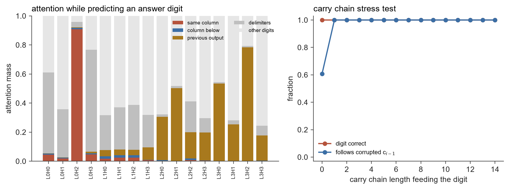
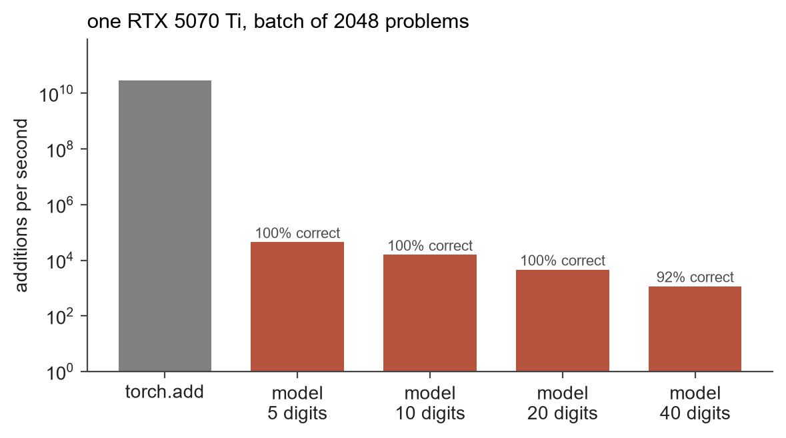

<picture>
  <source media="(prefers-color-scheme: dark)" srcset="assets/carrybit-dark.png">
  
</picture>

Tiny transformers learning exact integer arithmetic, and a look at how they do it.

This started as a half-joke: what if you trained a tiny network to do CPU-style
arithmetic and ran a pile of copies on a GPU as virtual cores? As engineering
that is backwards, since the GPU already does exact arithmetic in hardware. As
an excuse to study how small models learn algorithms it turned out to be a good
one. Everything here runs on one consumer GPU in minutes to an hour, and the
models top out at a few million parameters.

## Setup

You need Python 3.12+, [uv](https://docs.astral.sh/uv/), and an NVIDIA GPU. The
pinned PyTorch build is for CUDA 12.8, which covers 50-series cards.

```
uv sync
uv run python -c "import torch; print(torch.cuda.is_available())"
uv run pytest
```

Every experiment is a YAML file in `configs/` and a script in `experiments/`.
Training writes metrics to `runs/<name>/metrics.csv` and saves checkpoints
alongside them. Final checkpoints from every run in this README are on
[Hugging Face](https://huggingface.co/SuperGoatScriptGuy/carrybit), with the
config and metrics log next to each one. Any config value can be overridden on the command line:

```
uv run python -m carrybit.train configs/modular_add.yaml train.weight_decay=0.1
```

## Results

### Modular addition groks

The baseline is the setup from Nanda et al.: a one-layer transformer trained on
30% of all pairs (a, b) with a + b mod 113 as the label, full-batch AdamW with
weight decay 1. Training accuracy hits 100% within a hundred steps while test
accuracy stays around 30%, then climbs to 100% a couple of thousand steps
later. That is a shorter memorization plateau than in the paper, most likely
because this model uses layer norm, but the shape is the same.


```
uv run python -m carrybit.train configs/modular_add.yaml
uv run python experiments/grokking_curve.py
```

### Grokking sharpens structure that is already there

Swaroop (2026) argues that grokking on modular addition does not discover the
Fourier algorithm, it cleans up structure that formed during memorization. The
measurement: take the DFT of each neuron's input weights for operand a, for
operand b, and of its map to the logits. Structured neurons use one frequency
in all three, and their phases obey phase_out = phase_a + phase_b, which is
what makes the ReLU of two cosines add angles. The strongest test is to rebuild
an MLP from nothing but those per-neuron frequencies, phases and amplitudes and
ask how well it adds.

I reproduced this on the paper's setup, a one-hidden-layer ReLU MLP with
two-hot inputs, p = 97, 30% of pairs, weight decay 1:



The phase-sum relation holds at 0.999 from the first moment there are enough
periodic neurons to measure it, around step 3000, and never wavers. The
idealized model built from the extracted parameters runs far ahead of the
network's own test accuracy: 55% versus 0.5% at step 7500, 85% versus 33% at
step 20k. The network takes another 30k steps to catch up with the algorithm
its own weights already encode. That is the paper's claim, and it reproduces.

Then the same measurement on the one-layer transformer from the first
section. A transformer neuron has no direct input weights per operand, so I
use its pre-activation averaged over the other operand as a stand-in, and its
column of the down-projection pushed through the unembedding as its logit map.
Three weight decays:



- **Weight decay 1**: structure appears even earlier than in the MLP. The
  idealized model is at 82% by step 1000 when the network tests at 34%, and
  at 96% by step 1500 when the network tests at 54%.
- **Weight decay 0.1**: grokking takes ten times longer, and the structure
  tracks that. The idealized model is at 82% at step 5000, network at 32%.
- **No weight decay**: the network never groks in 40k steps, sitting at 33%
  test accuracy. Its extracted structure still reaches 81%. The algorithm is
  latent in a network that never generalizes, which is the paper's noisy-label
  result reproduced with a different obstacle.

So the mechanism is architecture-independent as far as this test can tell.
Weight decay controls how fast the network converges onto structure it forms
anyway, not whether the structure forms.

```
uv run python -m carrybit.train configs/modular_mlp.yaml
uv run python -m carrybit.train configs/modular_add.yaml train.weight_decay=0.1 name=modular_add_wd0.1 --run-dir runs/modular_add_wd0.1
uv run python -m carrybit.train configs/modular_add.yaml train.weight_decay=0 name=modular_add_wd0 --run-dir runs/modular_add_wd0
uv run python experiments/grokking_fourier.py
```

### Length generalization: the ladder

The main experiment. Train on addition with operands of 1 to 20 digits, then
test on operands of exactly n digits for n up to 100, with exact match on the
whole answer as the score. Nine ways of presenting the problem, same 3.4M
parameter model (4 layers, width 256), same budget (50k steps of 256 examples),
three seeds each:

- **plain**: `$653+49=702$`, most significant digit first.
- **reversed**: digits least significant first, so the carry flows left to right.
- **reversed + zero pad**: operands padded to the same length, answer to one more.
- **abacus** (McLeish et al.): learned position embedding that restarts at 1 for
  every number, with a random offset during training.
- **position coupling** (Cho et al.): digits of the same significance in both
  operands and the answer share one position id.
- **zero pad + relative**: a learned per-head bias on attention scores indexed by
  distance, instead of absolute positions. A control for the last rung.
- **blankspace var** and **blankspace fixed** (the ICLR submission below): blank
  tokens inserted at identical indices in both operands and the answer during
  training. In the var version each example gets a random number of blanks and
  the test input has none. In the fixed version every number is padded to 121
  slots at training time and test operands are padded with blanks on the right
  to the same width, so the sequence length never changes.
- **blankspace fixed + relative**: the paper's headline combination.


Faint lines are seeds, the bold line is the mean, the dotted line is the
longest training length. Exact match at the end of training:

| format | 20 digits | 30 | 40 | 50 |
|---|---|---|---|---|
| plain | 0.89 | 0 | 0 | 0 |
| reversed, zero pad, zero pad + relative, blankspace var | 1.00 | 0 | 0 | 0 |
| abacus | 1.00 | 0.31 (best 0.93) | 0.25 (best 0.75) | 0.08 |
| position coupling | 1.00 | 0.31 (best 0.92) | 0.04 | 0 |
| blankspace fixed | 0.99 | 0.81 (best 0.96) | 0.39 (best 0.68) | 0.04 |
| blankspace fixed + relative | 0 | 0 | 0 | 0 |

What happened:

- Every format learns the training distribution, though plain is noticeably
  worse at 20 digits. Reversing the digits is the one free lunch in this list.
- Everything with sequential positions falls to exactly zero one step past the
  training length, relative bias included. Per-digit error jumps from 0 to
  about 90% on every digit: the model has no idea where it is.
- Abacus and position coupling extend past the training length and fail
  gracefully. At 40 digits the best coupling seed still gets each digit right
  90 to 100% of the time, but with 41 digits per answer the small errors
  compound into 7% exact match.
- **Fixed-width blankspace is the only data-only trick that generalizes**, and
  on this budget it is the best rung, about 2x with no architecture change. The
  variable-width version does nothing, so it is the fixed layout doing the
  work, not the blanks. Note what the fixed layout buys: a 40-digit test problem
  has the same sequence length as a 20-digit training problem, just fewer
  blanks. That is a weaker kind of length generalization than the other methods
  attempt, and worth keeping in mind when reading the paper's 200-digit claim.
- The paper's headline combination, fixed blankspace with relative positions,
  never learned at all here: zero accuracy even at 5 digits, on all three
  seeds. The model emits blanks where digits should go. My relative bias is a
  scalar per head and distance, which is less expressive than the Shaw-style
  relative embeddings the paper uses, so this is a limitation of my
  implementation rather than a verdict on theirs.
- Seed variance dominates everything else. One abacus seed reaches 50 digits,
  the other two are at zero by 25. Zhou et al. reported the same thing and it
  is not subtle.

```
uv run python experiments/length_ladder.py
uv run python experiments/length_ladder.py --watch    # live progress board while it runs
```

### Scaling up

The papers that report 5x or more use bigger models and far more examples, so
the two position-id methods got a second run at 11M parameters (6 layers,
width 384), trained on 1 to 30 digits for 60k steps and tested to 200.



Scale helped position coupling and did nothing for abacus. Coupling went from
about 1.7x to 2.5x: the better seed holds 97% at 50 digits and 75% at 60. Both
abacus seeds generalized zero digits past their training length, worse than
the best small abacus seed. Still nowhere near 200.

Fixed blankspace got the same treatment, at the exact model size the paper
uses (6 layers, width 384), trained on 1 to 20 digits with every number padded
to 121 slots, two seeds:



| | 20 | 30 | 40 | 50 | 60 |
|---|---|---|---|---|---|
| seed 0 | 1.00 | 0.95 | 0.63 | 0.20 | 0.01 |
| seed 1 | 1.00 | 0.94 | 0.54 | 0.16 | 0.01 |

Consistent across seeds, which is rare in this project, and a real improvement
over the small model. But it lands in the same place as coupling: 2 to 2.5x,
not 10x. The paper's 200-digit result needs its relative position embeddings,
which I could not make work with my simpler relative bias.

```
uv run python experiments/length_ladder.py --config configs/addition_big.yaml --rungs "abacus,position coupling" --seeds 0,1
uv run python experiments/length_ladder.py --config configs/blankspace_big.yaml --rungs "blankspace fixed" --seeds 0,1
```

### Out-of-distribution accuracy is a transient

This one I did not expect. Every run that generalized past its training length
peaked early and then lost most of it, while in-distribution accuracy stayed
at 100% and training loss kept falling. The 11M coupling seed above was at 85%
on 60 digits at step 15k and 75% at the end. The best small coupling seed was
at 63% on 40 digits at step 17k and 11% at the end.



Two ablations on the small coupling model, three seeds each:

- **Constant learning rate** instead of cosine decay: the erosion gets worse,
  not better. Seed 0 peaked at 71% on 40 digits and ended at 2%. So the decay
  to zero is not the cause; if anything it freezes the model wherever it lands.
- **No weight decay**: the one seed that generalized climbed monotonically to
  92% at 40 digits and never eroded. The other two seeds never generalized.

So with weight decay, every run that found a generalizing solution later drifted
away from it. Without weight decay, the one run that found it kept it. That is
one seed, so treat it as a lead rather than a result. But the practical
consequence holds regardless: papers reporting the final checkpoint and papers
reporting the best checkpoint are measuring different things, and the gap here
is large.

```
uv run python experiments/length_ladder.py --rungs "position coupling" --set train.cosine=false --name addition_constant_lr
uv run python experiments/length_ladder.py --rungs "position coupling" --set train.weight_decay=0 --name addition_no_wd
uv run python experiments/generalization_over_training.py
```

### Find the carry

The namesake. Take the best small coupling model (the no-weight-decay seed
above, 4 layers, 4 heads) and ask where the carry comes from when it predicts
answer digit i. Three measurements:

- Attention mass by source, averaged over answer positions: the same column
  (a_i, b_i), the column below (a_{i-1}, b_{i-1}), the model's own previous
  output digit c_{i-1}, delimiters, or other digits.
- Teacher-forced accuracy on digit i when the carry feeding it originated k
  columns below and rippled through k columns that sum to exactly 9.
- A counterfactual: replace c_{i-1} in the prefix with the digit it would have
  been without its incoming carry, and count how often the prediction for c_i
  follows the corrupted digit.



It is a ripple carry, and the carry wire is the output stream. One head in
layer 0 puts 91% of its attention on the same column: that is the digit adder.
Heads in layers 2 and 3 attend to the previous output digit. The counterfactual
shows why: whenever the column below sums to 9, so the carry into i depends on
the carry into i-1, corrupting c_{i-1} flips the prediction for c_i 100% of the
time, for chains of any length. The model reads its own last digit, compares it
with a_{i-1} + b_{i-1}, and infers whether a carry came in. Because the
recursion runs through autoregression rather than through depth, chain length
costs nothing: accuracy is 100% out to 14-column chains. That is exactly a
ripple-carry adder, one column per generated token.

```
uv run python experiments/find_the_carry.py
```

### The neural ALU, measured

The original joke, taken seriously for one afternoon. Load the carry model
above, batch 2048 addition problems, decode the answers greedily, and count
additions per second against the GPU adding 16 million integers natively.



| | adds per second | exact match | hardware adds per model add |
|---|---|---|---|
| torch.add | 3.0e10 | 1.000 | 1 |
| model, 5 digits | 44,700 | 1.000 | 670,000 |
| model, 10 digits | 15,800 | 1.000 | 1.9 million |
| model, 20 digits | 4,600 | 1.000 | 6.5 million |
| model, 40 digits | 1,170 | 0.924 | 26 million |

So a 20-digit addition costs about six and a half million hardware additions,
and roughly 8 billion floating point operations, to produce one exact result.
The cost grows quadratically with digit count because generation has no
key-value cache, so every output token reruns the whole prefix. A cache would
buy maybe an order of magnitude. The gap would still be six zeros wide, and the
answers would still start going wrong past the training length. Virtual cores
this is not.

```
uv run python experiments/neural_alu.py
```

## What I would try next

- More seeds on the no-weight-decay coupling run. If most of them hold their
  generalization, weight decay is the culprit and that is worth a proper study.
- Shaw-style relative embeddings, to give the paper's headline combination a
  fair test.
- A key-value cache for generation. Evaluating 200-digit problems without one is
  quadratic and dominated the cost of the scaled runs.

## Related work

- Power et al., [Grokking](https://arxiv.org/abs/2201.02177) (2022). The original observation.
- Nanda et al., [Progress measures for grokking via mechanistic interpretability](https://arxiv.org/abs/2301.05217) (2023). The Fourier clock algorithm and the training setup used here.
- Lee et al., [Teaching arithmetic to small transformers](https://arxiv.org/abs/2307.03381) (2023). Reversed digits and data formats.
- Zhou et al., [Transformers can achieve length generalization but not robustly](https://arxiv.org/abs/2402.09371) (2024). Seed variance is the enemy.
- McLeish et al., [Abacus embeddings](https://arxiv.org/abs/2405.17399) (2024).
- Cho et al., [Position coupling](https://arxiv.org/abs/2405.20671) (2024).
- [Data augmentations for arithmetic length generalization](https://openreview.net/forum?id=UZovxtlIym) (ICLR 2026 submission). Aligned blankspace augmentation.
- Swaroop, [Latent algorithmic structure precedes grokking](https://arxiv.org/abs/2603.23784) (2026). The claim reproduced in the Fourier experiment.

## License

MIT.
