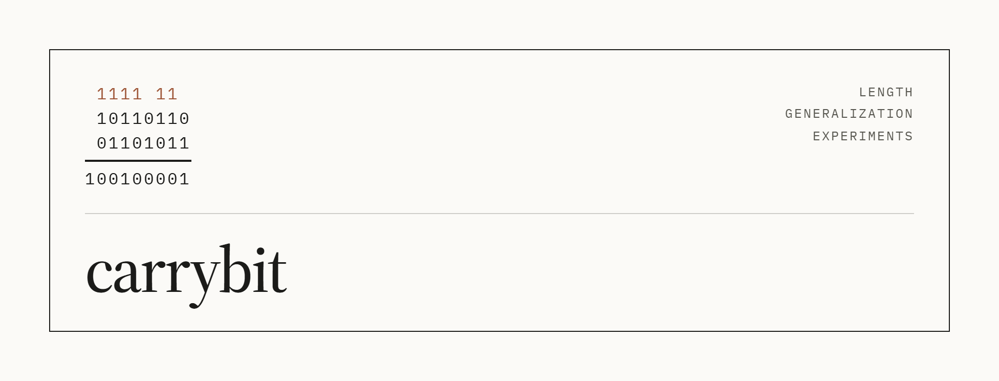
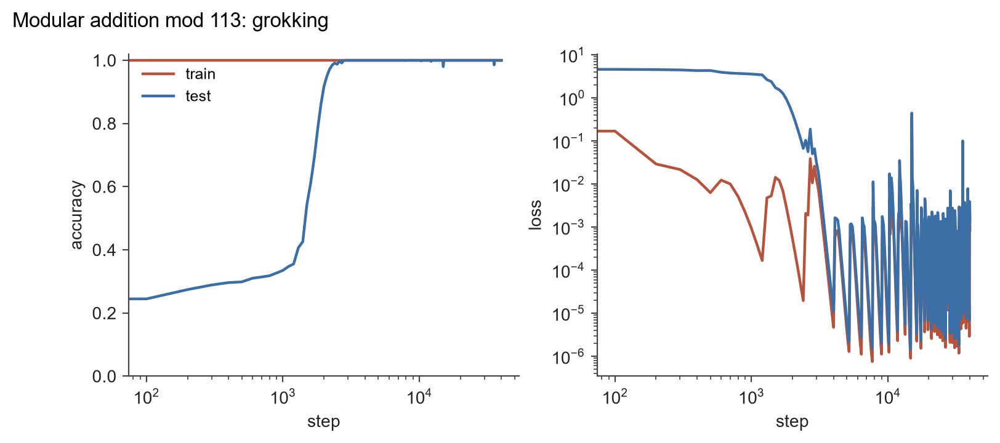
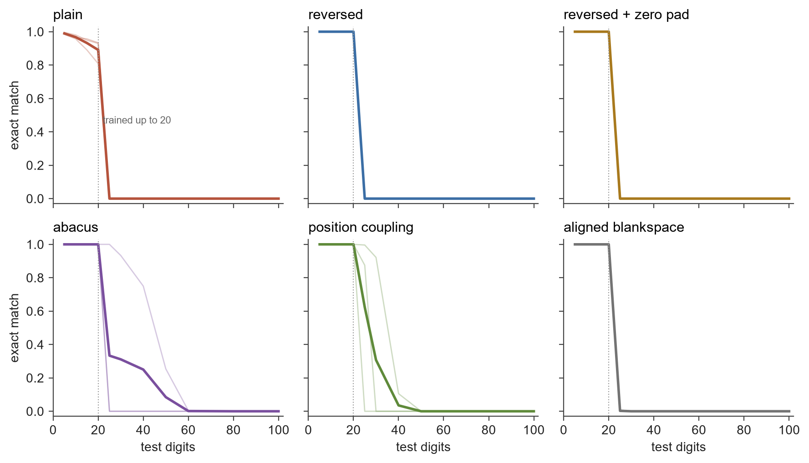

<picture>
  <source media="(prefers-color-scheme: dark)" srcset="assets/carrybit-dark.png">
  
</picture>

Tiny transformers learning exact integer arithmetic, and a look at how they do it.

This started as a half-joke: what if you trained a tiny network to do CPU-style
arithmetic and ran a pile of copies on a GPU as virtual cores? As engineering
that is backwards, since the GPU already does exact arithmetic in hardware. As
an excuse to study how small models learn algorithms it turned out to be a good
one. Everything here runs on one consumer GPU in minutes, and the models are
all well under a million parameters.

## Setup

You need Python 3.12+, [uv](https://docs.astral.sh/uv/), and an NVIDIA GPU. The
pinned PyTorch build is for CUDA 12.8, which covers 50-series cards.

```
uv sync
uv run python -c "import torch; print(torch.cuda.is_available())"
uv run pytest
```

Every experiment is a YAML file in `configs/` and a script in `experiments/`.
Training writes metrics to `runs/<name>/metrics.csv` and saves checkpoints
alongside them. Final checkpoints from every run in this README are on
[Hugging Face](https://huggingface.co/SuperGoatScriptGuy/carrybit), with the
config and metrics log next to each one. Any config value can be overridden on the command line:

```
uv run python -m carrybit.train configs/modular_add.yaml train.weight_decay=0.1
```

## Results

### Modular addition groks

The baseline is the setup from Nanda et al.: a one-layer transformer trained on
30% of all pairs (a, b) with a + b mod 113 as the label, full-batch AdamW with
weight decay 1. Training accuracy hits 100% within a hundred steps while test
accuracy stays around 30%, then climbs to 100% a couple of thousand steps
later. That is a shorter memorization plateau than in the paper, most likely
because this model uses layer norm, but the shape is the same.



```
uv run python -m carrybit.train configs/modular_add.yaml
uv run python experiments/grokking_curve.py
```

### Length generalization: the ladder

The main experiment. Train on addition with operands of 1 to 20 digits, then
test on operands of exactly n digits for n up to 100, with exact match on the
whole answer as the score. Six ways of presenting the problem, same 3.4M
parameter model (4 layers, width 256), same budget (50k steps of 256 examples),
three seeds each:

- **plain**: `$653+49=702$`, most significant digit first.
- **reversed**: digits least significant first, so the carry flows left to right.
- **reversed + zero pad**: operands padded to the same length, answer to one more.
- **abacus** (McLeish et al.): learned position embedding that restarts at 1 for
  every number, with a random offset during training.
- **position coupling** (Cho et al.): digits of the same significance in both
  operands and the answer share one position id.
- **aligned blankspace**: zero padded, plus blank tokens inserted at the same
  relative indices in both operands and the answer during training.



Faint lines are seeds, the bold line is the mean, the dotted line is the
longest training length. What happened:

- Every format learns the training distribution, though plain is noticeably
  worse at 20 digits (89% versus 100% for everything else). Reversing the digits
  is the one free lunch in this list.
- The three sequential-position formats fall to exactly zero one step past the
  training length. Past 20 digits the model reads position embeddings it has
  never seen, and per-digit error jumps from 0 to about 90% on every digit.
- Abacus and position coupling both extend past the training length, and they
  fail differently: gracefully. At 40 digits the best coupling seed still gets
  each digit right 90 to 100% of the time, but with 41 digits per answer the
  small errors compound into 7% exact match. The best abacus seed holds 75%
  exact match at 40 digits.
- Seed variance dominates. One abacus seed reaches 50 digits, the other two are
  at zero by 25. Zhou et al. reported the same thing and it is not subtle.
- Aligned blankspace did nothing here. It matches the zero pad baseline exactly.
  I could not get the paper's PDF past OpenReview's bot check, so this is my
  reading of the method from the abstract: blanks at identical relative indices
  in all three numbers, up to 100 per number, no blanks at test time. If the
  real method differs, this rung is testing something else.

So no 10x on this budget. The papers that report 5x or more use bigger models,
more layers, and far more examples. Whether that is the missing ingredient is
the next question: `configs/addition_big.yaml` is the same ladder with 6 layers,
width 384, training to 30 digits, testing to 200.

```
uv run python experiments/length_ladder.py
uv run python experiments/length_ladder.py --watch    # live progress board while it runs
```

## Related work

- Power et al., [Grokking](https://arxiv.org/abs/2201.02177) (2022). The original observation.
- Nanda et al., [Progress measures for grokking via mechanistic interpretability](https://arxiv.org/abs/2301.05217) (2023). The Fourier clock algorithm and the training setup used here.
- Lee et al., [Teaching arithmetic to small transformers](https://arxiv.org/abs/2307.03381) (2023). Reversed digits and data formats.
- Zhou et al., [Transformers can achieve length generalization but not robustly](https://arxiv.org/abs/2402.09371) (2024). Seed variance is the enemy.
- McLeish et al., [Abacus embeddings](https://arxiv.org/abs/2405.17399) (2024).
- Cho et al., [Position coupling](https://arxiv.org/abs/2405.20671) (2024).
- [Data augmentations for arithmetic length generalization](https://openreview.net/forum?id=UZovxtlIym) (ICLR 2026 submission). Aligned blankspace augmentation.
- Swaroop, [Latent algorithmic structure precedes grokking](https://arxiv.org/abs/2603.23784) (2026). The claim reproduced in the Fourier experiment.

## License

MIT.
